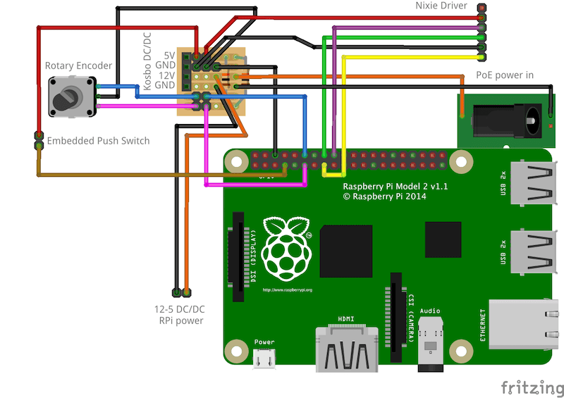

# Building _Sunrise_

## Parts list

### Electrical

- 1x Raspberry Pi (any model with ethernet, eg. v[2B](https://www.raspberrypi.org/products/raspberry-pi-2-model-b/) or v[3B](https://www.raspberrypi.org/products/raspberry-pi-3-model-b/))
- 2x [Nixie Duo](hardware/ogilumen/nixie duo board.pdf) & [Nixie Driver](hardware/ogilumen/nixie driver board.pdf) boards
- 1x 12V Nixie power supply (eg. [from Kosbo](gardware/kosbo/nixie power module.pdf))
- 1x 3A or greater 12V DC power supply (eg. [from Amazon](https://www.amazon.co.uk/gp/product/B00KNT5UVW/ref=oh_aui_detailpage_o01_s00?ie=UTF8&psc=1))
- 1x 12V to 5V DC/DC converter to power the Raspberry Pi (eg. [this car "power inverter", with a Micro USB plug on the 5V side](https://www.amazon.co.uk/gp/product/B00U2DGJD2/ref=oh_aui_detailpage_o01_s01?ie=UTF8&psc=1))
- 1x 360º rotary encoder switch (eg. [from Amazon, with spares](https://www.amazon.co.uk/gp/product/B0197X1UZY/ref=oh_aui_detailpage_o01_s01?ie=UTF8&psc=1))
- 1x Passive PoE injector/splitter kit (eg. [from Amazon, with spares](https://www.amazon.co.uk/gp/product/B01M4GJGI8/ref=oh_aui_detailpage_o01_s01?ie=UTF8&psc=1))
- Female-Female Dupont wires, for joining components (eg. [from Amazon](https://www.amazon.co.uk/gp/product/B01EV70C78/ref=oh_aui_detailpage_o01_s01?ie=UTF8&psc=1))

## Manufacture

We've used a small piece of stripboard to join various parts of the system together, particularly the power rails:

The 12V supply arriving over passive PoE is used to power the Nixie power module and, via the DC/DC converter, the Raspberry Pi. The ground rails for each part are kept separate to prevent fluctuations from affecting the operation of the Raspberry Pi.

The HV power lines from the Nixie power module are connected directly to the Nixie Driver (see [page 5 of the spec](hardware/ogilumen/nxie driver board.pdf) for pins).

The GPIO pins have been chosen broadly at random, feel free to move them if you change the appropriate parts of the code.
